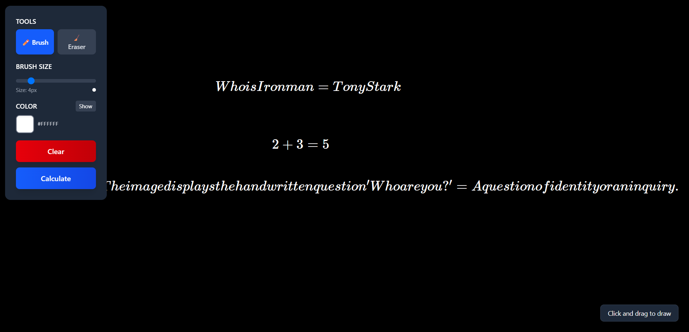

# 🎨 AI Tab Editor

An intelligent drawing and calculation application that combines freehand drawing with AI-powered mathematical computation. Draw equations, expressions, or mathematical problems on a digital canvas, and get instant AI-generated solutions.

![AI Tab Editor Demo]


## ✨ Features

### 🎯 Core Functionality

- **Digital Canvas**: Full-screen black canvas for smooth drawing experience
- **AI-Powered Calculations**: Draw mathematical expressions and get instant solutions
- **Smart Recognition**: Uses Google Gemini AI to interpret handwritten math
- **Real-time Results**: Calculations appear as draggable LaTeX expressions
- **Variable Storage**: Supports variable assignment and reuse in calculations

### 🖌️ Drawing Tools

- **Brush Tool**: Customizable drawing with multiple colors
- **Eraser Tool**: Precise erasing with adjustable size
- **Brush Size Control**: 1px to 20px with visual preview
- **Color Palette**: Multiple colors with toggleable interface
- **Clear Canvas**: One-click canvas reset

### 📱 User Experience

- **Mobile Responsive**: Optimized for both desktop and mobile devices
- **Touch Support**: Full touch gesture support for mobile drawing
- **Draggable Results**: Move calculation results anywhere on screen
- **Intuitive UI**: Clean, modern interface with visual feedback
- **Real-time Preview**: See brush size and color before drawing

## 🛠️ Technology Stack

### Frontend

- **React 18** - Modern React with hooks
- **Vite** - Fast build tool and development server
- **TypeScript** - Type-safe development
- **Tailwind CSS** - Utility-first CSS framework
- **Canvas API** - Native drawing capabilities
- **MathJax** - Mathematical notation rendering
- **React Draggable** - Draggable components
- **Axios** - HTTP client for API requests

### Backend

- **FastAPI** - High-performance Python web framework
- **Python 3.8+** - Backend programming language
- **Google Gemini AI** - Advanced AI for math recognition
- **Uvicorn** - ASGI server for FastAPI
- **Pydantic** - Data validation and serialization
- **Base64** - Image encoding for API transmission

## 📋 Prerequisites

- **Node.js** 16.0 or higher
- **Python** 3.8 or higher
- **npm** or **yarn** package manager
- **pip** Python package manager
- **Google Gemini API Key** (required for AI functionality)

## 🚀 Quick Start

### 1. Clone the Repository

```bash
git clone https://github.com/karthikeyamadhavan123/JARVIS-ai-caluclator.git
cd ai-tab-editor
```

### 2. Frontend Setup

```bash
# Navigate to frontend directory
cd frontend

# Install dependencies
npm install
# or
yarn install

# Create environment file
touch .env

# Add your backend URL to .env
echo "VITE_API_URL=http://localhost:8000" > .env

# Start development server
npm run dev
# or
yarn dev
```

### 3. Backend Setup

```bash
# Navigate to backend directory
cd backend

# Create virtual environment
python -m venv venv

# Activate virtual environment
# On Windows:
venv\Scripts\activate
# On macOS/Linux:
source venv/bin/activate

# Install dependencies
pip install -r requirements.txt

# Create environment file
touch .env

# Add your Gemini API key to .env
echo "GEMINI_API_KEY=your_gemini_api_key_here" > .env

# Start the server
uvicorn main:app --reload --host 0.0.0.0 --port 8000
```

### 4. Access the Application

- **Frontend**: https://jarvis-ai-caluclator.vercel.app/
- **Backend API**: http://localhost:8900,

## 📦 Installation Guide

### Frontend Dependencies

```bash
npm install react react-dom
npm install -D @types/react @types/react-dom
npm install vite @vitejs/plugin-react
npm install typescript
npm install tailwindcss postcss autoprefixer
npm install axios
npm install react-draggable
npm install @types/react-draggable
```

### Backend Dependencies

```bash
pip install fastapi
pip install uvicorn[standard]
pip install python-multipart
pip install Pillow
pip install google-generativeai
pip install python-dotenv
pip install pydantic
pip install typing-extensions
```

## 🔧 Configuration

### Environment Variables

#### Frontend (.env)

```env
VITE_API_URL=http://localhost:8900,
```

#### Backend (.env)

```env
GEMINI_API_KEY=your_actual_gemini_api_key_here
ALLOWED_ORIGINS=http://localhost:5173,https://jarvis-ai-caluclator.vercel.app/
PORT=8900
```

### API Configuration

The backend automatically configures CORS to allow requests from your frontend. Update the `ALLOWED_ORIGINS` environment variable to match your frontend URL.

## 📡 API Endpoints

### POST `/calculate`

Processes canvas image and returns mathematical calculations.

**Request Body:**

```json
{
  "image": "data:image/png;base64,iVBORw0KGgoAAAANSUhEUgAA...",
  "dictOfVars": {
    "x": "5",
    "y": "10"
  }
}
```

**Response:**

```json
{
  "data": [
    {
      "expr": "2 + 3",
      "result": "5",
      "assign": false
    }
  ]
}
```

### GET `/health`

Health check endpoint for monitoring.

**Response:**

```json
{
  "status": "healthy",
  "timestamp": "2024-01-01T12:00:00Z"
}
```

## 🎨 Usage Guide

### Drawing Mathematical Expressions

1. **Select Brush Tool**: Choose the brush from the tools panel
2. **Adjust Brush Size**: Use the slider to set your preferred size
3. **Choose Color**: Toggle the color palette and select a color
4. **Draw Expression**: Write your mathematical expression on the canvas
5. **Calculate**: Click the "Calculate" button to process your drawing
6. **View Results**: Results appear as draggable LaTeX expressions

### Supported Mathematical Operations

- **Basic Arithmetic**: `+`, `-`, `*`, `/`
- **Powers and Roots**: `x^2`, `√x`, `x^(1/2)`
- **Fractions**: `1/2`, `3/4`
- **Variables**: `x = 5`, `y = x + 3`
- **Equations**: `2x + 3 = 7`
- **Functions**: `sin(x)`, `cos(x)`, `log(x)`

### Using Variables

1. Draw an assignment: `x = 5`
2. Click Calculate to store the variable
3. Use the variable in subsequent expressions: `y = 2x + 1`
4. The system remembers variables throughout the session

## 🏗️ Project Structure

```
ai-tab-editor/
├── client/
│   ├── public/
│   ├── src/
│   │   ├── components/
│   │   │   ├── TabEditor.tsx
│   │   │   └── DraggableLatex.tsx
│   │   ├── constants/
│   │   │   └── colors.ts
│   │   ├── types/
│   │   │   └── types.ts
│   │   ├── App.tsx
│   │   └── main.tsx
│   ├── package.json
│   ├── vite.config.ts
│   ├── tailwind.config.js
│   └── tsconfig.json
├── server/
│   ├── main.py
│   │   schema.py
│   ├── services/
│   │   ├── gemini_service.py
│   │   └── calculation_service.py
│   ├── requirements.txt
    | constants.py
    |--apps/caluclator
      |---route.py
      |--utlis.py
│   └── .env
├── README.md
└── .gitignore
```

## 🔍 Features in Detail

### Canvas Drawing System

- **HTML5 Canvas**: High-performance drawing with smooth lines
- **Touch Events**: Full mobile support with touch gestures
- **Composite Operations**: Proper eraser implementation using destination-out
- **Dynamic Sizing**: Canvas automatically adjusts to screen size

### AI Integration

- **Image Processing**: Converts canvas to base64 for API transmission
- **Gemini Vision**: Uses Google's multimodal AI for image understanding
- **Context Awareness**: Maintains variable context across calculations
- **Error Handling**: Graceful fallbacks for unrecognized expressions

### User Interface

- **Responsive Design**: Works seamlessly on all device sizes
- **Visual Feedback**: Real-time preview of brush size and color
- **Accessibility**: Proper ARIA labels and keyboard navigation
- **Performance**: Optimized rendering with React best practices

## 🧪 Testing

### Frontend Testing

```bash
# Run tests
npm test

# Run tests with coverage
npm run test:coverage

# Run E2E tests
npm run test:e2e
```

### Backend Testing

```bash
# Install test dependencies
pip install pytest pytest-asyncio httpx

# Run tests
pytest

# Run with coverage
pytest --cov=. --cov-report=html
```

## 🚀 Deployment

### Frontend Deployment (Vercel/Netlify)

```bash
# Build for production
npm run build

# Preview production build
npm run preview
```

### Backend Deployment (render)

### no docker yet

```dockerfile
FROM python:3.9-slim

WORKDIR /app
COPY requirements.txt .
RUN pip install -r requirements.txt

COPY . .
EXPOSE 8000

CMD ["uvicorn", "main:app", "--host", "0.0.0.0", "--port", "8000"]
```

### Environment Setup for Production

```bash
# Build and run with Docker
docker build -t ai-tab-editor-backend .
docker run -p 8000:8000 --env-file .env ai-tab-editor-backend
```

## 🛡️ Security Considerations

- **API Keys**: Never commit API keys to version control
- **CORS Configuration**: Properly configure allowed origins
- **Input Validation**: Validate all user inputs on backend
- **Rate Limiting**: Implement rate limiting for API endpoints
- **Image Size Limits**: Limit canvas image size for security

## 🤝 Contributing

1. **Fork the Repository**
2. **Create Feature Branch**: `git checkout -b feature/amazing-feature`
3. **Commit Changes**: `git commit -m 'Add amazing feature'`
4. **Push to Branch**: `git push origin feature/amazing-feature`
5. **Open Pull Request**

### Development Guidelines

- Follow TypeScript/Python best practices
- Add tests for new features
- Update documentation
- Ensure mobile responsiveness
- Test across different browsers

## 📝 License

This project is licensed under the MIT License - see the [LICENSE](LICENSE) file for details.

## 🙏 Acknowledgments

- **Google Gemini** - AI-powered mathematical recognition
- **React Team** - Excellent frontend framework
- **FastAPI** - High-performance backend framework
- **MathJax** - Beautiful mathematical notation rendering
- **Tailwind CSS** - Utility-first CSS framework

## 📞 Support

- **Issues**: [GitHub Issues](https://github.com/karthikeyamadhavan123/JARVIS-ai-caluclator/issues)
- **Discussions**: [GitHub Discussions](https://github.com/karthikeyamadhavan123/JARVIS-ai-caluclator/discussions)
- **Email**: karthikeyamadhavan095@gmail.com

## 🗺️ Future Vision

- [ ] **Geometric Shape Recognition** - Detect and perfect drawn shapes
- [ ] **Graph Plotting** - Visualize mathematical functions
- [ ] **Export Features** - Save results as PDF or images
- [ ] **Collaborative Editing** - Real-time collaboration support
- [ ] **Advanced Mathematics** - Support for calculus, linear algebra
- [ ] **Voice Commands** - Voice-to-math input
- [ ] **Offline Mode** - PWA support for offline usage

---

**Built with ❤️ using React, FastAPI, and Google Gemini AI**
